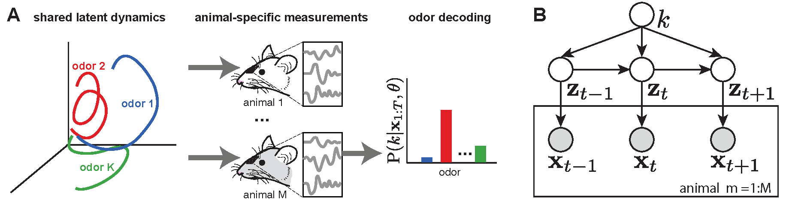

# Across-animal odor decoding by probabilistic manifold alignment (NeurIPS 2021)

This repository is the official implementation of aligned mixture of latent dynamical systems (amLDS) published at NeurIPS 2021.

amLDS is a probabilistic method to align neural responses and efficiently decode stimuli across animals. It learns independent mappings of different recordings into a shared latent manifold, where stimulus-evoked dynamics are similar (identical) across animals but distint across stimuli allowing for accurate stimulus decoding. 

A full description of the algorithm can be found in the [NeurIPS 2021 manuscript](https://proceedings.neurips.cc/paper/2021/hash/aad64398a969ec3186800d412fa7ab31-Abstract.html).

## Requirements

* numpy == 1.16.2
* matplotlib == 3.0.3
* seaborn == 0.9.0
* sklearn == 0.20.3
* scipy == 1.2.1
* python == 3.7.3+

## Usage

To get started, run the example notebook ['amLDS_example'](amLDS_example.ipynb). This notebook contains an example on the use of amLDS on synthetic data. It shows how to perform parameter learning, inference and stimulus decoding; as well as latent dimensionality estimation.

To explore other properties and capabilities of amLDS check the ['amLDS_mixturesConcentration'](amLDS_mixturesConcentration.ipynb) notebook or run the performance script as python3 ['amLDS_Performance_DataDemands_ModelComparison.py'](amLDS_mixturesConcentration.ipynb).

## Copyrights and license
This code has been released under the GNU AGPLv3 license. For the usage of modification of any of this repository content cite:

[Pedro Herrero-Vidal, Dmitry Rinberg, Cristina Savin, "Across-animal odor decoding by probabilistic manifold alignment". bioRxiv, 2021](./misc/across-animal-odor-decoding-by-probabilistic-manifold-alignment.bib)
